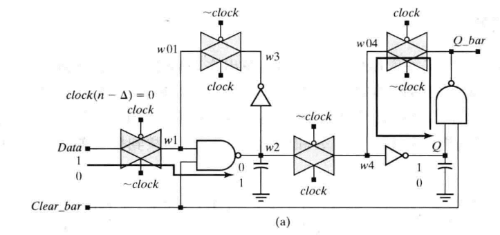
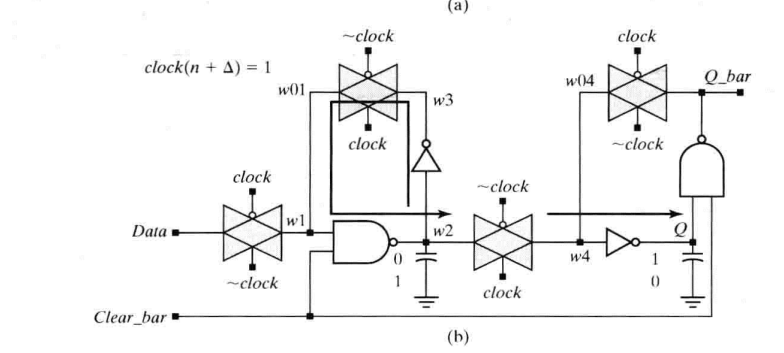

### 经典电路

#### HDLBits重点复习

#### 同步与异步复位 

- 同步复位的优点大概有3条：
      a、有利于仿真器的仿真。
      b、有利于时序分析，而且综合出来的fmax一般较高。
      c、只有在时钟有效电平到来时才有效，所以可以滤除高于时钟频率的毛刺。
      缺点主要有以下几条：
      a、复位信号的有效时长必须大于时钟周期，才能真正被系统识别并完成复位任务。同时还要考虑，诸如：clk skew,组合逻辑路径延时,复位延时等因素。
      b、FPGA内寄存器中支持异步复位专用的端口CLR，所以，倘若采用同步复位的话，综合器就会在寄存器的数据输入端口插入组合逻辑，这样就会耗费较多的逻辑资源。
- 对于异步复位来说，他的优点也有三条：
      a、大多数目标器件库的dff都有异步复位端口，因此采用异步复位可以节省资源。
      b、设计相对简单。
      c、异步复位信号识别方便，而且可以很方便的使用FPGA的全局复位端口GSR。
      缺点： 
      a、在复位信号释放(release)的时候容易出现问题。具体就是说：倘若复位释放时恰恰在时钟有效沿附近，就很容易使寄存器输出出现亚稳态，从而导致亚稳态。
      b、复位信号容易受到毛刺的影响。
- 异步复位同步释放电路

#### 跨时钟域CDC

https://www.cnblogs.com/icparadigm/p/12794483.html 
https://www.cnblogs.com/icparadigm/p/12794422.html
Verilog HDL高级数字设计5.17

- 亚稳态

  - 是什么

    时序逻辑在跳变时，由于异步信号、跨时钟域等原因，不满足setup或hold条件，输出在0和1之间产生振荡。

  - 原因

    D触发器的内部是一个主从锁存器(master-slave latch)，依靠背靠背的反相器锁存数据。

    

    时钟为低电平时，主锁存器更新输入值，从锁存器保持上一个输出值不变。

    

    时钟为高电平时，主锁存器保持上一个输出值不变，从锁存器更新输入。

    

    由于反相器需要一定时间才能锁定，若时钟跳变前后，未完成锁存时钟就改变，最后输出的电平高低会不稳定，这就是亚稳态。

  - 危害

    错误的逻辑会一直传递下去导致系统错误。

  - 指标

    MTBF-- mean time between failure. 两次失效之间的平均时间。
    $$
    MTBF(T_{MET})=\frac{e^{T_{MET}}}{C_1} * \frac{1}{C_2*f_{clk}*f_{data}}
    $$
    C1 和C2 是常数，依赖于器件工艺和操作环境。

    fCLK 和fDATA 参数取决于设计规格：fCLK 是接收异步信号的时钟域的时钟频率，fDATA 是异步数据的翻转频率（toggling frequency）。

    TMET 参数是亚稳态转稳定的时间（Metastability setting time）,或者说时序裕量大于寄存器Tco可以让潜在的亚稳态信号达到稳定的值的时间。**TMET 对同步链来说就是链中每个寄存器输出时序裕量的和。**

  - 减少亚稳态的方法

    1. 改善工艺
    2. 降低时钟速率和数据翻转。
    3. 增大时序裕量（使用多级同步器打拍）

- 单bit情况

  - 快时钟域到慢时钟域

    脉冲同步器，通过组合逻辑把脉冲展宽为电平信号

  - 慢时钟域到快时钟域

    电平同步（持续实际大于1.5倍时钟频率），直接打拍。

  - 应用

    - 输入去抖

      

    - 无毛刺时钟切换 

    

- 多bit情况

  - 多个信号合并

  - 多周期路径法

  - 使用格雷码传递多个CDC位

  - 使用异步FIFO来传递多位信号

- Valid-Ready握手协议

  

#### 有限状态机

- 分类

  - 一段式
  - 二段式
  - 三段式

  - Moore型
  - Mealy型

- 状态编码的选择

  见:[编码](#jump1)

- 序列检测器

- 饮料售卖机

- 回文序列检测

#### FIFO

- 异步FIFO深度计算（背靠背）

- 同步

  - 深度为1

  - FF实现

  - SRAM实现

  - 乒乓buffer

- 异步

#### 分频计数器

- 奇数

- 偶数

- 小数

#### 数字计算

- 超前进位加法器
- booth乘法器
- wallace乘法器
- Wallace树
- 除法器

#### 总线通信

- 串并转换
- UART
- I2C
- SPI

#### 其他

- 边缘检测，输入消抖，毛刺消除
- 计数器：二进制，移位，移位+反向
- 串行-并行CRC

## 低功耗设计基础

## 总线与通信协议

- AXI总线
- DDR
- **UDP**
  - **ARP协议**

## 计算机组成原理

- 流水线结构

  - 超流水

  - 旁路

  - 分支预测
  - 超标量
  - 多发射
  - 乱序执行

- 储存

  - cache

  - MMU

  - TLB

  - ROM

  - RAM

  - SRAM

  - DRAM

  - SDRAM

  - DDR SDRAM