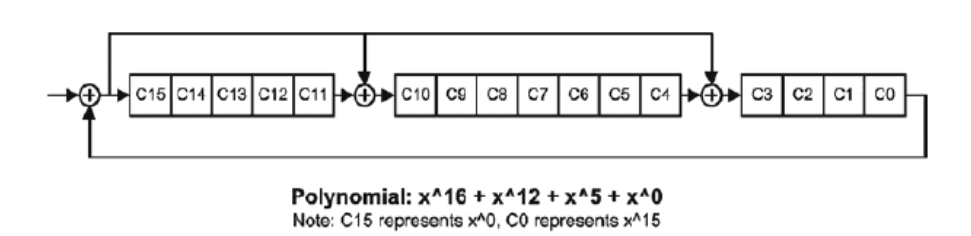

#### HDLBits重点复习

#### 有限状态机FSM

- 分类

  - 一段式

    所有逻辑写在一个always模块，不建议

  - 二段式

    一个always描述组合逻辑（状态转移逻辑、状态输出），一个描述时序逻辑（各状态的行为）

  - 三段式

    二段式的基础上，把状态转移和状态输出分离开，易于修改，推荐

  - Moore型

    moore的输出只和当前状态有关。

  - Mealy型

    mealy的输出和当前状态和输入都有关。Mealy型和Moore可以互相转化。mealy型所需状态数更少。

- 状态编码的选择

  格雷码：可节省状态寄存器，适合写适合写条件不复杂但是状态多的状态机。
  独热码：节省组合逻辑，稳定性强，适合写条件复杂但是状态少的状态机。

  （对于FPGA，可用资源数固定，资源足够就用独热码）

- 序列检测器0010

  - FSM
  - LFSR

- 饮料售卖机

  设计一个自动饮料售卖机，共有两种饮料，其中饮料 A 每个 10 分钱，饮料 B 每个 5 分钱，硬币有 5 分和 10 分两种，并考虑找零。
  要求用状态机实现，定义状态，画出状态转移图，并用 Verilog 完整描述该识别模块

- 回文序列检测

#### FIFO

- 异步FIFO深度计算（背靠背）

  关键点：空、慢信号的产生，多bit信号跨时钟域。

- 同步

  关键点：空、慢信号的产生。

  1. 使用计数器
  2. 拓展最高位（推荐）

  ```verilog
  module sync_fifo#(
  	parameter fifo_width = 8;
  	parameter fifo_depth = 512;
  	parameter fifo_addr = 9;
  
  )
      
      (
  	input clk,
  	input rst_n,
  	input fifo_wr_en,
  	input fifo_rd_en,
  	input [fifo_width-1:0]	fifo_wr_data,
  	
  	output fifo_full,
  	output [fifo_width-1:0]fifo_rd_data,
  	output fifo_empty
  
  );
  	
  
  	
  
      reg [fifo_addr-1:0] rdaddress;
      reg [fifo_addr-1:0] wraddress;
      reg [fifo_addr:0] rdaddress_e;
      reg [fifo_addr:0] wraddress_e;
  	
  	assign rdaddress = rdaddress_e[fifo_addr-1:0];
  	assign wraddress = wraddress_e[fifo_addr-1:0];
  	
  	//空满标志生成
  	assign fifo_full = (rdaddress_e[fifo_addr] != wraddress_e[fifo_addr] && rdaddress == wraddress )?1'b1:1'b0;
  	assign fifo_empty = (rdaddress_e == wraddress_e)?1'b1:1'b0;
  	
  	//读地址
  	always@(posedge clk or negedge rst_n)
  	if(!rst_n)
  		rdaddress_e <= 0;
  	else if( fifo_rd_en && ~fifo_empty )
  		rdaddress_e <= rdaddress_e + 1'b1;
  	
  	//写地址
  	always@(posedge clk or negedge rst_n)
  	if(!rst_n)
  		rdaddress_e <= 0;
  	else if( fifo_wr_en && ~fifo_full )
  		rdaddress_e <= rdaddress_e + 1'b1;
  	
  	ram ram(
  		.clock					( clk ),
  		.data					( fifo_wr_data ),
  		.rdaddress				( rdaddress ),
  		.wraddress				( wraddress ),
  		.wren					( fifo_wr_en ),
  		.q						( fifo_rd_data )
  	);
  endmodule
  
  
  ```

  其他变的体

  - 深度为1，无缓存的Valid-ready协议

    ```verilog
    module Handshake_Protocol(
       input   clk, 
       input   rst_n,
       //upsteam
       input   valid_i, 
       output  ready_o, 
       //downsteam
       output  valid_o, 
       input   ready_i, 
       //data
       input   din, 
       output  reg dout
    );
    
    reg     full;
    wire    wr_en;
    
    always @(posedge clk or negedge rst_n)begin
       if(rst_n == 1'b0)begin
           dout <= 0;
           full <= 0;
       end
       else if(wr_en == 1'b1)begin
           if(valid_i == 1'b1)begin
               full <= 1;
               dout <= din;
           end
           else begin
               full <= 0;
               dout <= dout;
           end
       end
       else begin
           full <= full;
           dout <= dout;
       end
    end
    
    assign  wr_en = ~full | ready_i;
    
    assign  valid_o = full;
    assign  ready_o = wr_en;
    
    endmodule
    ```

    

  - FF实现

  - SRAM实现

  - 乒乓buffer

    在读写直接需要等待时候使用，实质为流水线技术，用面积换速度，读写可以同时进行。

    典型应用：解决深度流水线中的时序反压问题，将长的握手链切割。

- 异步

#### 数字计算

- 超前进位加法器
- booth乘法器
- wallace乘法器
- Wallace树
- 除法器
- 浮点数运算


#### 其他

- 边缘检测

  ```verilog
  module top_module (
      input clk,
      input [7:0] in,
      output [7:0] pedge
  );
      reg [7:0] temp;
      always@(posedge clk)begin
          temp<=in;
          pos_edge<=(~t&in);
          neg_edge<=(t&~in);
          both_edge<=pos_edge|neg_edge;
          //both_edge<=t^in;
      end
  endmodule
  ```

- 双边缘触发器

  ```verilog
  //法一：对结果进行寄存
  module top_module (
      input clk,
      input d,
      output q
  );
      reg q1,q2;
      assign q=clk?q1:q2;
      always @(posedge clk) q1<=d;
      always @(negedge clk) q2<=d;
  endmodule
  
  //法2：时钟倍频
  //法3；对时钟进行寄存
  ```

- 优先编码器

  - casez  ？

- 伪随机码发生器（线性反馈移位寄存器）

  与CRC类似。SEED通过生成多项式后生成了伪随机序列。M个触发器最多有2^N-1种状态（不能出现全0的死锁状态）。

  ```verilog
  //8bit F(x)=X^8+X^4+X^3+X^2+1
  module rand_gen
  (
  	input reset,
      input clk,
      input load,
      input [7:0] seed,
      output reg [7:0] rand_num
  );
      integer i;
      always@(posedge reset or posedge clk) begin
          if(reset)
              rand_num<=8'b0;
          else if(load)
              rand_num<=seed;
          else begin
              for(i=1;i<8;i=i+1)
                  rand_num[i]<=rand_num[i-1];
              //斐波那契LFSR 也称为多到一型LFSR，即抽头序列对应bit位置的多个触发器的输出通过异或逻辑来驱动一个触发器的输入
              rand_num[0]<=rand_num[1]^(rand_num[2]^(rand_num[3]^rand_num[7]))
              //伽罗瓦LFSR  抽头间进行一级异或，速度更快
              /*rand_num[0]<={rand_num[0],
                            rand_num[7]^rand_num[3],
                            rand_num[6:3],
                            rand_num[3]^rand_num[2],
                            rand_num[2]^rand_num[1],
                            rand_num[1]}*/
          end
      end
  endmodule
  ```

  

- 奇偶校验

  ```verilog
  function cal_parity_odd;
  input [31:0]address;
  begin
    cal_parity=^address;//缩减异或，1的个数为偶数结果为0，奇数为1
  end
  
      
  function cal_parity_even;
  input [31:0]address;
  begin
    cal_parity=^address;//缩减异或，1的个数为偶数结果为1，奇数为0
  end
  ```

  

- 串行-并行CRC

  - CRC由一称为生成多项式的常数去除该数据流的二进制数值而得，商数被放弃，余数作为冗余编码追加到数据流尾，产生新的数据流进行发送。在接收端，新的数据流被同一常数去除，检查余数是否为零。如果余数为零，就认为传输正确，否则就认为传输中己发生差错，该数据流重发。不同的生成多项式有不同的检错能力，为了得到优化的结果，必须根据需要选择合适 的生成多项式。

    | 名称         | 生成多项式                           | 简记式   | 应用                                       |
    | ------------ | ------------------------------------ | -------- | ------------------------------------------ |
    | CRC-4        | $X^4+X+1$                            | 3        |                                            |
    | CRC-8        | $X^8+X^5+X^4+1$                      | 0x31     |                                            |
    | CRC-8        | $X^8+X^2+X^1+1$                      | 0x07     |                                            |
    | CRC-8        | $X^8+X^6+X^4+X^3+X^2+X^1$            | 0x5E     |                                            |
    | CRC-12       | $X^{12}+X^{11}+X^3+X+1$              | 80F      |                                            |
    | CRC-16       | $X^{16}+X^{15}+X^2+1$                | 8005     | IBM SDLC                                   |
    | CRC-16-CCITT | $X^{16}+X^{12}+X^5+1$                | 1021     |                                            |
    | CRC-32       | $X^{32}+X^{26}+X^{23}+...+X^2+X+1$   | 04C1DB7  | ZIP，RAR，**IEEE 802 LAN/FDDI**，IEEE 1394 |
    | CRC-32C      | $X^{32}+X^{28}+X^{27}+...+X^8+X^6+1$ | 1EDC6F41 | SCTP                                       |

  - 计算过程：

    1. 将数据乘以$X^n$，n为生成多项式的最高次系数（CRC-n即为n），直接把数据左移n位。
    2. 左移后的数据，使用模2除法除以生成多项式，计算余数。
    3. 余数附加到原始数据后,发送。
    4. 接收端，传输信息的前一部分为原始数据流D;后一部分(最后n位数)为余数R。整个 数据流多项式被同一生成多项式G去除，商数被丢弃，余数应为0。如果余数不为0,说明传输数 据时发生错误，数据需要重传。

  - **串行CRC**:通常，CRC校验码的值可以通过线性移位寄存器和异或门求得，线性移位寄存器一次右移一 位，完成除法功能，异或门完成不带进位的减法功能。如果G(X)系数为’1’，则从被除数的高阶位减去除数，同时移位寄存器右移一位，准备为被除数的较低位进行运算。如果商数为’0’，则移位寄存器直接右移一位。

  - 

    ```verilog
    //CRC8 G(X)=X^16+X^12+X^5+1
    module CRC16_SER
        ( input Reset , //Reset signal 
          input Gclk ，//Clock signal 
          input Soc ， //Start of cell Data 
          input in，//input data of cell Crc 
          output reg [15:0] out //output CRC signal 
        )；
    	reg temp;
        integer i,j,k,l;
        always @(posedge Reset or posedge Gclk) 
            begin 
                if (Reset) 
                    Crc_out <= 16’b0;
                else if (Soc = l’bl) 
                    Crc_out <=16’b0 ;
                else begin 
                    Temp = Data_in ^ Crc_out[15]; 
                    
                    for (j=15;j>12;j=j-l) 
                        Crc_out[j] <= Crc_out[j-1]; 
                    Crc_out[12] <=Temp ^ Crc_out[ll]; 
                    
                    for (k=11;k>5;k=k-1) 
                        Crc_out[k] <=  Crc_out[k-1]; 
                    Crc_out[5] <=  Temp ^ Crc_out[4];
                    
                    for (l=4;l>0;l=l-1)
                        Crc_out[l] <= Crc_out[l-1];
                    Crc_out[0] <= Temp
                end
            end            
    endmodule
        
        
    ```

    

  - **并行CRC**:并行CRC校验码产生器 16位CRC同时输出，所以要求在一个时钟周期内，移位寄存器一次需要移16位。实际上，移位寄 存器不可能在一个时钟周期内移16位，所以这部分电路是用**组合逻辑来完成**。整个CRC校验码产生器由组合逻辑和16个输出寄存器组成。

    并行CRC计算较为复杂，可以参考：https://blog.csdn.net/tmdbyc/article/details/105116043
    
    一般使用工具直接生成：http://www.easics.com/webtools/crctool
    
    
    
    
  
- 独热码检测

  ```verilog
  function automatic logic is_onehot(input [WIDTH-1:0] sig);
    localparam SUM_WIDHT = $clog2(WIDTH) + 1;
    logic [SUM_WIDTH-1:0] sum;
    sum = '0;
    for(int i = 0; i < WIDHT; i++)
       sum = sum + sig[i];
    is_onehot = (sum == 1);
  endfunction
  //或者使用SVA内建函数 $isonehot() $isonehot0()
  ```
  
- 串并转换

  整数倍，直接使用寄存器。非整数倍，用状态机，取公倍数。


