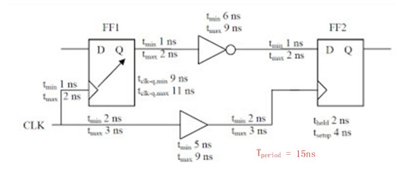

### 时序约束

#### 时序约束的作用

- 在综合中
  - 优化：面积、功率、性能约束
  - 输入重排序：传达各种输入信号的到达时间
  - 输入缓冲：传达外部输入的驱动能力
  - 输出缓冲：传达输出端口需要驱动外部负载的信息
- 在STA中
  - 约束作为声明：工具不验证准确性和正确性
  - 约束作为断言：检查，若不满足约束认为时序违例
  - 约束作为指令：综合、布局布线时工具根据约束识图满足目标
  - 约束作为异常：指定某些路径，允许更为宽松的时序

#### 时序异常的约束

- 虚假路径	

  不需要满足任何时序要求的路径，EDA忽略该路径的时序

- 多周期路径

  需要多个周期来传输数据的路径，EDA放宽该路径的时序

- 最小延迟和最大延迟

  当有对最小延迟和最大延迟有特殊要求（与setup、hold约束的推测值不同）时指定

#### SDF文件

Standard Delay Format：标准延时格式文件，描述各种延迟约束。

#### OCV

​	OCV（On-chip-Variation），片上变化，OCV（on-chip variation）是指在同一个芯片上, 由于制造工艺和环境（PVT）等原因导致芯片上各部分特征不能完全一样，从而造成偏差，对时序分析造成影响。这些偏差对互联线和cell的延时都是有影响的。

由于OCV对延时有影响，那么我们在进行时序分析时需要将这些OCV效应考虑进来。在STA中，通过对不同的时序路径添加derate系数，来完成对OCV的建模，将OCV效应纳入分析。

#### PTV

​	 PVT也称为Operating condition，分别是Process工艺，Voltage电压，Temperature温度，有下列组合

- WC：worst case slow，低电压，高温度，慢工艺 -> 一般情况下delay最大，setup 差。
- WCL：worst case low-temperature，低电压，低温度，慢工艺 -> <u>温度反转效应</u>时delay最大，setup差。
- LT：即low-temperature，也叫bc（best case fast），高电压，低温度，快工艺 -> 一般情况下delay最小，hold差。
- ML：max-leakage，高电压，高温度，快工艺 -> 温度反转效应下delay最小，hold差。
- TC：typical，也叫tt，普通电压，普通温度，标准工艺 -> 各种typical。
- BC：Best case。高电压，快工艺，常温0℃ or 25℃。
- 注：温度反转效应（Temperature Inversion Effect）
  - 工艺在90nm以上的时候，随着温度的升高，delay增大，所以worst corner是PVTmax，
  - 是65nm以下，随着温度的降低，delay增大，worst corner可能是PVTmax,也可能是PVTmin，这就是温度反转效应。
  - 温度对Transistors的影响：低温时，迁移率增大(导致快switching趋势)，但是Vt增大(导致慢switching趋势)，最后结果取决于迁移率和Vt谁起更重要作用（65nm以下制程主要是Vt起作用，90nm以上主要是电子迁移率）。
  - 温度对寄生参数的影响：低温时，wire电阻更低。

#### 共同路径悲观效应

如下图，common clock path即属于launch clock path，也属于capture clock path，所以在计算中，我们对其使用了不同的derate系数进行计算：在计算arrival time中，系数为1.2；在计算required time中，系数为0.9，这样会让我们的分析更为悲观，电路性能更差。而在真实的情况中，common clock path的PVT只有一个，不可能同时有两个derate系数，所以我们会进行CPPR操作。

**CPPR**（Clock Path Pessimism Removal）或者**CRPR**(Clock Reconvergence Pessimism Removal)，中文名“**共同路径悲观去除**”。它的作用是去除clock path上的相同路径上的悲观计算量，即我们上面提到的问题。我们将common point定义为时钟树上共同部分最后一个cell的output pin。则定义CPP因子为：

```verilog
//同一时钟，一段按最快路径（clk->B）计算，一段按最慢路径(clk->A)计算，导致约束过于悲观。可声明公用部分，修正补偿延迟差异，称为“时钟网络悲观效应降低”

					  +---\\--+     *****    +-----+      
                      |     +---** C1  *---+     |      
                      | F1  |     *****    | F2  |      
                      |     |              |     |      
                    +-+>A   |         |----+>B   |      
                    | +-----+         |    +-----+      
                    |                 |                 
                    .                 .                 
                   /_\               /_\                
                    |                 |                 
          clk       |                 |                 
          ----------+-----------------+               
```


#### setup time与hold time和什么有关

https://blog.csdn.net/FBICIACCC/article/details/52683901

直观而言，SETUP要求数据要比时钟“走得快”，HOLD则防止采到的新数据太快到达而“冲掉”原来的正确数据，数据必须要在一定时间之后才允许到达。

数据跑得越快（TDelay越小），时钟传输时延越大（clock skew越大）对建立时间的满足越有利，而对保持时间的满足越不利，相反则对满足保持时间越有利，对满足建立时间越不利。

建立时间还跟时钟周期有关系，时钟周期越小，越容易发生建立时间违例，而保持时间则跟时钟周期没有关系。

#### clock Jitter与clock Skew

- clock Skew（时钟偏移）指同一时钟到达不同寄存器的时间偏移。一般由于时钟路径的长度，负载，驱动有关。在上例中，clock skew体现在$T_{clk\_path}$中。
  - 定义为到达后级寄存器的时间减到前级寄存器的时间，从公式可以看出，正skew（clk2晚于clk1）对建立时间有益，负skew（clk2早于clk1）对保持时间有益。
- clock Jitter（时钟抖动）指时钟源的频率不确定。一般由于晶振，电源，温度变化引起。clock jitter始终对电路性能造成负面的影响。
- 时钟约束中，clock uncertainty = clock jitter + clock skew。

#### setup和hold裕度计算

- setup

  $T_{data\_path}+T_{setup}<=T_{clk\_path}+T_{period}$

  变形：$T_{set\_slack} = T_{period} -（T_{cq}+T_{logic}）- T_{setup} + T_{skew}>0$

- hold

  $T_{data\_path}-T_{hold}>=T_{clk\_path}$

  变形：$T_{hold\_slack} = T_{cq}+T_{logic}-T_{hold} - T_{skew} > 0$

- 举例



$T_{data\_path}=2+11+2+9+2=26ns;T_{clk\_path}=2+5+2=9ns;26+4>9+15$

setup违例

$T_{data\_path}=1+9+1+6+1=18ns;T_{clk\_path}=3+9+3=15ns;18-2>15$

 hold无违例

**<u>总结：计算setup时数据路径延迟取最大，时钟路径延迟取最小；计算hold时相反</u>**


#### 时钟激励的约束


## 综合

#### 综合步骤

1. **translation**：分析HDL代码，用GTECH模型对HDL进行映射，这个模型是与技术库无关的

2. **logic optimization**：逻辑优化

3. **mapping**：进行逻辑映射和门级优化，将逻辑根据约束，映射为专门的技术目标单元库（target cell library）中的cell，形成综合后的网表

   在DC中，transition 对应命令为 read_verilog(read_vhdl等，或者**analyze+ elaborate**)，logic optimization 和 mapping 均在compile命令完成

#### 如何防止综合出不想要的latch

1.  case if等判断条件写全
2.  always 敏感列表（只对仿真有影响，但是综合工具会自动补全敏感向量列表，所以在综合之后的电路中是不会有latch）
3.  不要出现自己给自己赋值的情况
4.  不要出现组合逻辑环路

#### 如何确保可综合

- 时序逻辑用非阻塞赋值，组合逻辑用阻塞赋值，同一个always块中既有时序逻辑又有组合逻辑时用非阻塞赋值，不要在同一个always块中混合使用，不要在两个及以上always块中对同一个变量赋值
- 所有内部寄存器都能复位，通过复位使信号初始状态可预测
- 不混合使用上升下降沿（可以考虑使用倍频时钟来设计）
- 不使用initial，不要使用延时，不使用循环次数不确定的循环语句
- 防止出现非目的性的Latch
- 不使用用户自定义原语（UDP元件）
- 用always过程块描述组合逻辑，应在敏感信号列表中列出所有的输入信号。
- 尽量使用同步方式设计电路。

#### 可综合语句的电路

- mux：case、if条件互斥，会综合出带优先结构的mux；若条件若不互斥，综合工具可以综合出并行的mux。（x会被当成don't care 按逻辑最小化确定为0或1）

- 组合逻辑：always@（\*），其中\*为自动补全敏感列表确保不综合出latch；无反馈的assign

- 锁存器：带反馈的assign，未补全条件的if、case；未补全敏感列表的always@（），且描述的行为是电平敏感的；

- 三态元件与总线接口：具有高阻态分支的assign 

  ```verilog
  reg [31:0] clk_to_bus
  assign data_to_bus=bus_enable?clk_to_bus:32'bz;
  //连接到总线的单向接口，enable时两者连接，否则高阻态断开
  ```

- 触发器：不完整的if、case、always且描述的行为是边缘敏感的。

  当一个变量在被<u>**内部行为**</u>（非外部行为）引用前就被周期性赋值，综合过程将消除该变量。

  边缘敏感行为赋值并在行为外用到该变量，综合为触发器的输出。

#### 不可综合语句

1. initial：只能在test bench中使用，不能综合。（我用ISE9.1综合时，有的简单的initial也可以综合，不知道为什么） 
2. events：event在同步test bench时更有用，不能综合。 
3. real：不支持real数据类型的综合。 
4. time：不支持time数据类型的综合。 
5. force 和release：不支持force和release的综合。 
6. assign 和deassign：不支持对reg 数据类型的assign或deassign进行综合，支持对wire数据类型的assign或deassign进行综合。 
7. fork join：不可综合，可以使用非块语句达到同样的效果。 
8. primitives：支持门级原语的综合，不支持非门级原语的综合。 
9. table：不支持UDP 和table的综合。 
10. 敏感列表里同时带有posedge和negedge：如：always @(posedge clk or negedgeclk) begin...end    这个always块不可综合。 
11. 同一个reg变量被多个always块驱动 
12. 延时：以#开头的延时不可综合成硬件电路延时，综合工具会忽略所有延时代码，但不会报错。 如：a=#10 b;    这里的#10是用于仿真时的延时，在综合的时候综合工具会忽略它。也就是说，在综合的时候上式等同于a=b; 
13. 与X、Z的比较：可能会有人喜欢在条件表达式中把数据和X(或Z)进行比较，殊不知这是不可综合的，综合工具同样会忽略。所以要确保信号只有两个状态：0或1。

#### 综合命令

- dont_use

  部分单元库的单元，由于工艺、性能功耗面积等原因，工艺厂商建议或者后端建议，不要使用的单元。在综合步骤设置dont_use属性，就可以避免综合使用这些单元。

- dont_touch

  对目标模块，设置dont_touch属性。会使得该目标模块，不进行任何优化。
  比如已经综合完成的IP，在系统综合的时候，对IP模块设置dont_touch属性。不再对该IP进行任何综合优化，大大节省系统综合时间，避免不必要的结果检查。
  比如时钟网络，不关心时钟的负载，所以前端综合不要求加buffer。后端加时钟树时，才会把这个dont_touch属性去掉。

#### 可综合与不可综合的语句总结

- 所有综合工具都支持的结构 always，assign，begin，end，case，wire，tri，aupply0，supply1，reg，integer，default，for，function，and，nand，or，nor，xor，xnor，buf，not，bufif0，bufif1，notif0，notif1，if，inout，input，instantitation，module，negedge，posedge，operators，output，parameter 
- 所有综合工具都不支持的结构 time，defparam，$finish，fork，join，initial，delays，UDP，wait 
- 有些工具支持有些工具不支持的结构 casex，casez，wand，triand，wor，trior，real，disable，forever，arrays，memories，repeat，task，while。


#### HVT，SVT，LVT Cell的区别

根据不同的阈值电压，工艺库里的Cell大致分为HVT，SVT/RVT，LVT。H高，L低，S中等（standard/Regular）。阈值电压低，速度快，但由于关断漏电导致功耗高。

#### 门电路的内部延迟的平衡

​	tf（falling delay），tr（rising delay）两者一般不同，特殊要求的门（如时钟切换电路的or门）	需要两者平衡，可以使用工艺库提供的特殊cell，或者用下列方法平衡。

​	

## 时序分析

#### 查看时序报告

（DC） report-timing

#### 时序分析的分类和任务

- STA静态时序分析

  分析门级网表的拓扑结构，计算所有通路的传输延迟，生成有向无环图。但有可能检查了**无效路径**，从而生成错误虚假的违例警告。

- DTA动态时序分析

  基于电路的行为级、门级、开关级模型进行动态仿真。依赖于激励源，有可能漏掉关键路径，漏报时序违约。

- 两者对比

  |                              | STA          | DTA          |
  | ---------------------------- | ------------ | ------------ |
  | 方法                         | 仿真         | 路径分析     |
  | 激励源                       | 不需要       | 需要         |
  | 覆盖率                       | 与激励源无关 | 与激励源有关 |
  | 风险                         | 警告错误     | 丢失警告     |
  | **最大最小分析**，与综合配合 | 可           | 不可         |
  | 内存占用                     | 小           | 大           |
  | 运行时间                     | 快           | 慢           |

- 任务

  - 建立时间约束
  - 保持时间约束
  - 脉冲宽度约束
  - 时钟偏移（clock skew）约束
  - 时钟周期约束


#### HOLD违例修复：

- **hold违例一般可在后端修复，前端可以忽略**！

- Synopsys 方法

  - two-pass综合

    在排版前，用worst-case lid编译设计，获得最大setup-time,在layout后用best-case lib对设计再映射，从而修正hold-time，这个方法稳定性好。

  - Single pass 综合，通过DC命令

    - Set_fix_hold

        指示DC在采用CLK做时钟的电路合适的位置插入buffer或置换数据路径的cell而修正hold-time。在设计进行layout信息反标之后，用reoptimize _design命令修正hold-time,在layout之前，采用“compile –incremental”命令修正hold-time。

    - reoptimize _design命令

      支持min_max同时分析和优化；反标layout tool提供的min和max延时；用set_fix_hold <clock name>修正hold-time；

- 人为插入delay

  对于少于10-20处的hold-time 违例，可人为插入delay，一般都是通过加入一串连续的buffer,但因为buffer间距离过近，总的延时由buffer的cell延时决定，连接延时很小从而造成延时不足以修正hold-time。解决的办法是将多个高fanin 的门连结在一起，利用fanin 电容比单输入的buffer大，增加延时。

- 用DC命令自动插入延时

  用于hold-time 违例较多，用IPO费很多时间，对时序报告使用的script语言（perl 或 Awk)做语法分析，获得时序分析失败路径setup-time 的slack和hold-time的违例。根据这些结果，对失败路径，用户生成disconnect_net,create_cell,connect的DC命令，指示DC在合适的位置插入buffer.

#### SETUP违例修复：

1.    可以考虑关键路径上的逻辑并行化（重排部），减少链路延时。

2.  可以考虑有些功能电路的更优设计以降低延时，比如，超前进位加法器比行波逐位进位链加法器的延时更短。

3. 关键插入寄存器，形成流水线（pipline）。

4.  后端

   - 后端设计可以通过调整关键路径的时钟SKEW来解决，但是一般只是针对小范围的违例。
   - 可以采用多阈值单元，从半导体器件原理大家都知道，mos管阈值越小，其延时越小，可以在关键路劲采用阈值小的单元。

   - 可以采用面积更小的门级单元，面积大容载大，自然延时大（当然面积大的单元其驱动能力强）。
   - 可以通过适当提高工作电压来解决，电路的延时本质就是充放电的延时，如果电压越高，充放电时间就会越快。这也是为什么CPU超频时需要更高的工作电压。因此也可以通过提高关键模块的工作电压，划分不同的工作电压域。


#### 时序违例的修复

| 方案                         | 作用                             |
| ---------------------------- | -------------------------------- |
| 延长时钟周期(spec)           | 在性能指标约束内消除时序违例     |
| 调制关键路径(后端)           | 减少线网延迟                     |
| 更换器件，调制器件尺寸(后端) | 减少器件延迟，改善建立和保持裕度 |
| 时钟树重新设计(后端)         | 改善时钟偏移                     |
| 更好算法、系统结构（前端）   | 减少通路延迟                     |
| 改变工艺(spec)               | 减少器件和通路延迟               |